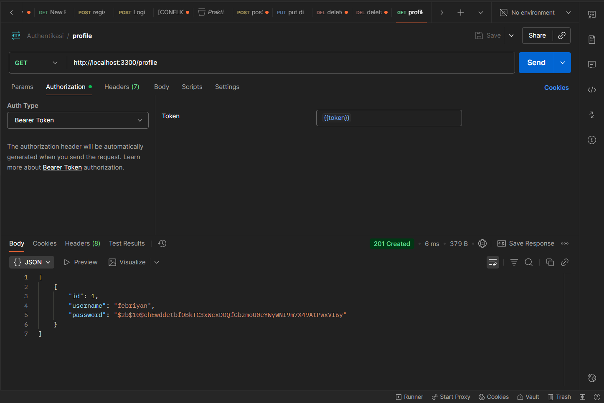
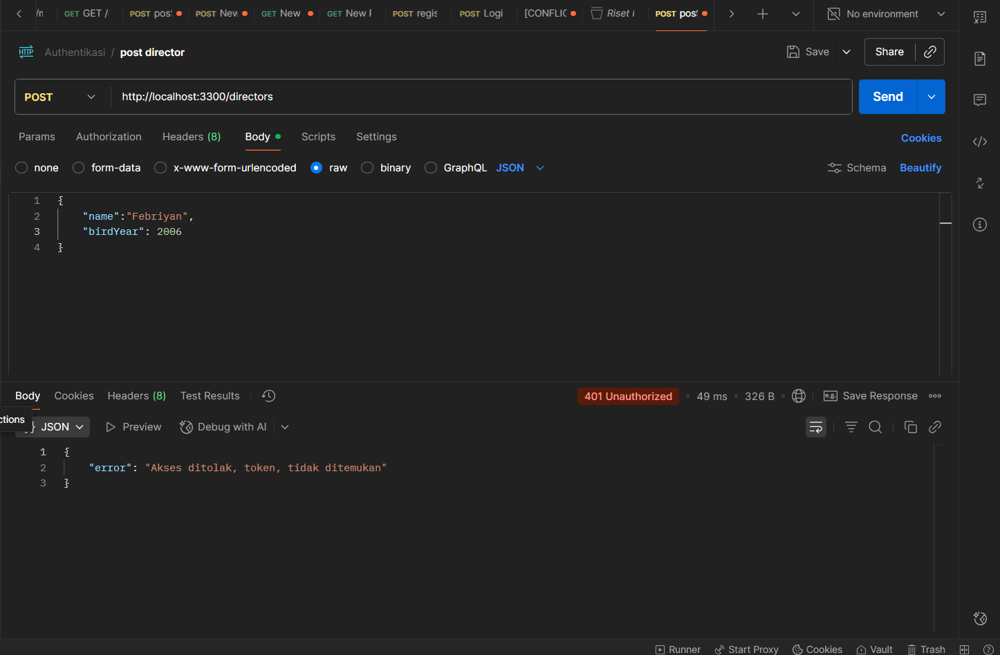
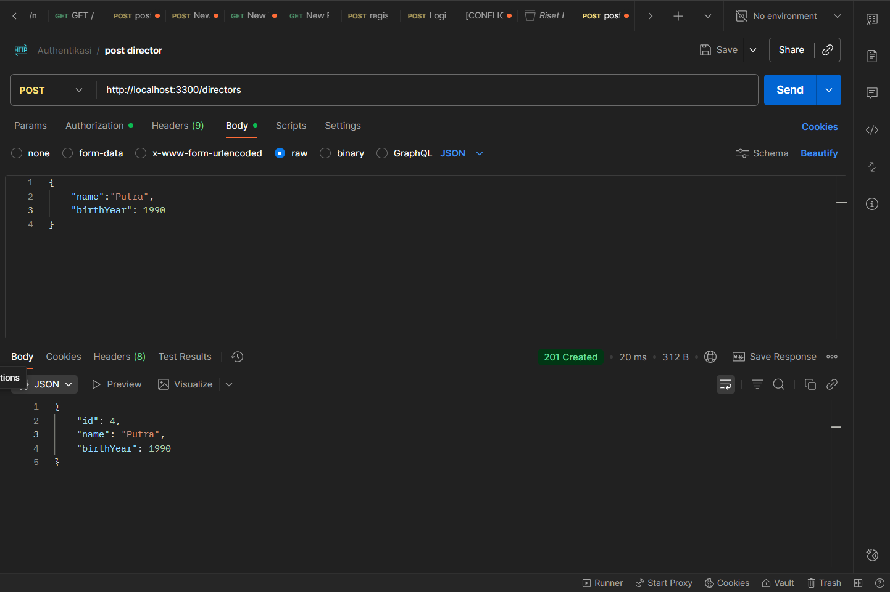
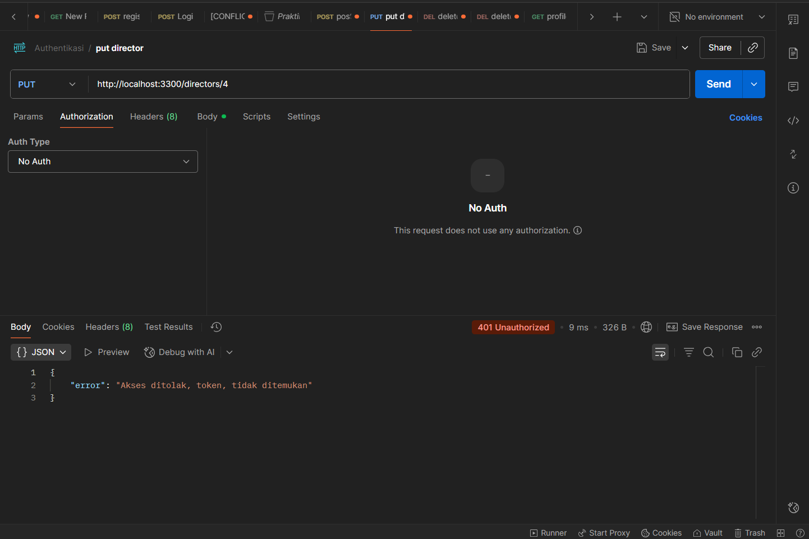
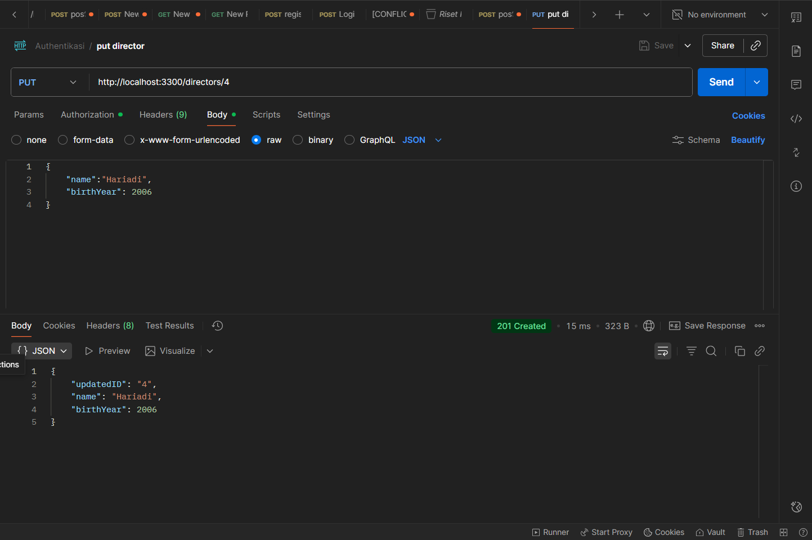

# NAMA : Febriyan Putra Hariadi
# NIM : 362458302042
# KELAS : 2D Teknologi Rekayasa Perangkat Lunak

## Praktikum PengamananAPI-Autentikasi dan Autorisasi dengan JWT

1.Terapkan middleware authenticateToken ke endpoint berikut:

-GET /profile dengan token

-POST /directors tanpa token

-POST /directors dengan token

-PUT /directors tanpa token

-PUT /directors dengan token

-DELETE /directors tanpa token

-DELETE /directors dengan token

## Lampiran file JSON

